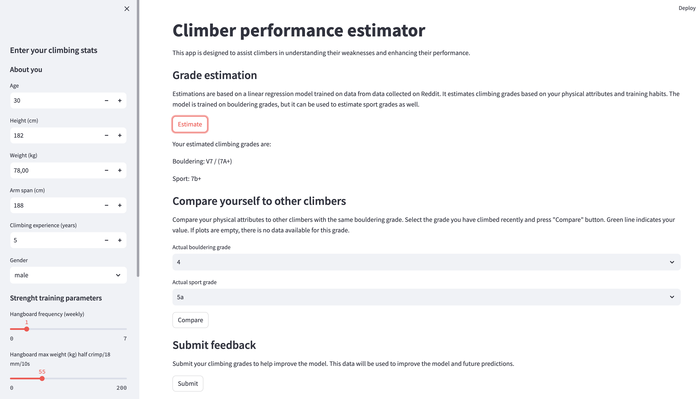

# Climb-harder Project :climbing:

This project is aimed at helping climbers understand their weaknesses and improve their performance. It's a Python application that predicts climbing grades based on a user's physical attributes and training habits. The application uses the Streamlit library for the web interface and a basic scikit-learn linear regression model for the predictions. The model is trained on data collected from Reddit.

## Features

- **Grade Estimation**: Users can input their physical attributes and training habits, and the application will estimate their climbing grades for both bouldering and sport climbing. The estimation is done by sending a POST request to a FastAPI application running on localhost.

- **Feedback Submission**: Users can provide their actual climbing grades for bouldering and sport climbing. This feedback, along with the user's physical attributes and training habits, is stored in a PostgreSQL database for future model improvement.

- **Comparison with Other Climbers**: Users can compare their physical attributes with other climbers who have the same bouldering grade. The comparison is visualized with box plots, where the user's values are indicated with a green line.

## Data

The data used for this project was downloaded from a [Reddit thread](https://www.reddit.com/r/climbharder/comments/gi7v2k/rquest_climbing_specific_datasets/).

## Demo

## Tech Stack

This project is built with the following technologies:

- **Programming Language**: Python
- **MLOps**: DVC, MLflow
- **Back-end**: FastAPI, Postgres 
- **Frontend**: Streamlit
- **Deployment**: Streamlit cloud

## Installation

TBC
